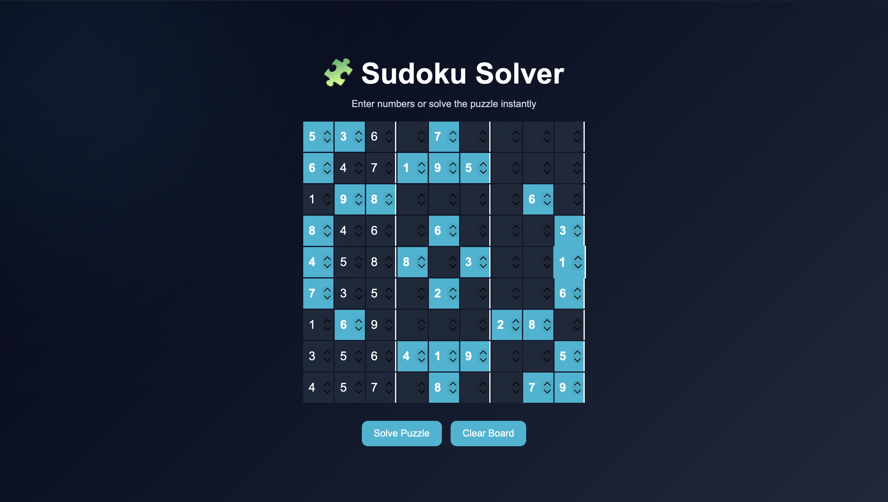
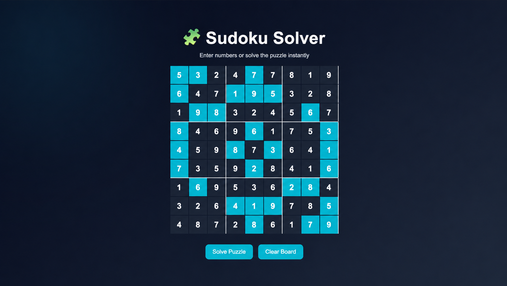

# 🧩 Sudoku Solver

An interactive Sudoku Solver built using HTML, CSS, JavaScript and the Backtracking Algorithm.

## 🚀 Features

- Solve Sudoku instantly
- Animated solving effect
- Responsive UI
- Pre-filled puzzle
- Modern glowing design

## 📸 Preview



## 🎯 Solved Puzzle



## 🛠️ Technologies

- HTML5
- CSS3
- JavaScript
- Backtracking Algorithm

## ▶️ Run Locally

```bash
git clone https://github.com/HarshaThummala4545/sudoku-solver.git
```

Open `index.html` in your browser.
